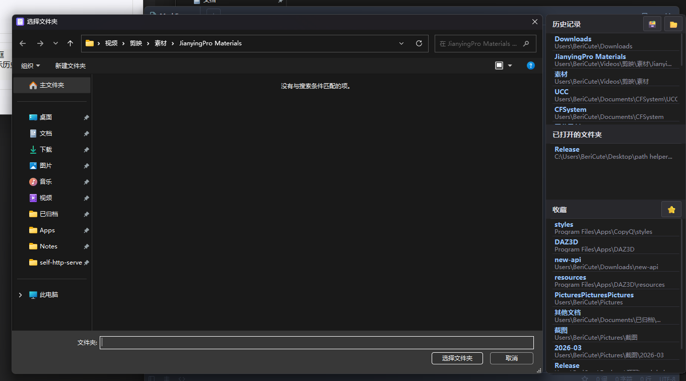

# PathHelper - Windows 文件对话框增强工具

PathHelper 是一个 Windows 文件对话框增强工具，通过注入 DLL 到文件对话框进程中，为标准的打开/保存对话框添加快速导航面板，支持历史路径记录、收藏夹和实时资源管理器路径监控。



## 功能特性

### 🚀 核心功能
- **历史路径记录**：自动记录文件对话框中访问过的路径，支持快速回溯
- **收藏夹管理**：添加常用路径到收藏夹，一键导航
- **实时资源管理器监控**：显示当前打开的资源管理器窗口路径，直接跳转
- **自动导航**：打开文件对话框时自动跳转到最近使用的路径

### 🎨 界面特性
- **现代化 UI**：使用 Direct2D 和 DirectWrite 渲染，支持圆角和阴影效果
- **主题支持**：内置浅色/深色主题，可自定义切换
- **可调节布局**：支持调整面板宽度、边距、字体大小等
- **路径智能显示**：自动隐藏公共路径前缀，显示关键路径信息

### ⚙️ 配置选项
- **注入进程管理**：选择要注入的目标进程（如 notepad、explorer 等）
- **快捷键支持**：自定义时间戳粘贴快捷键
- **自动启动**：支持开机自启并最小化到系统托盘
- **数据存储**：所有设置和历史记录存储在 `%USERPROFILE%\.PathHelper` 目录

## 系统要求

- **操作系统**：Windows 10/11（64 位）
- **开发环境**：Visual Studio 2022/2026
- **运行时**：需要 Visual C++ Redistributable 2022
- **权限**：需要管理员权限进行 DLL 注入

## 安装说明

### 方式一：下载发布版本
1. 从 [Releases](../../releases) 页面下载最新版本
2. 解压到任意目录
3. 运行 `PathHelper.exe`

### 方式二：从源码构建
1. 克隆仓库：
   ```bash
   git clone https://github.com/yourusername/pathhelper.git
   ```
2. 使用 Visual Studio 2022/2026 打开 `PathHelper.sln`
3. 选择 Release 配置（x64 或 Win32）
4. 构建解决方案
5. 输出文件位于 `Release/` 目录

## 使用方法

### 基本使用
1. 运行 `PathHelper.exe`
2. 在“注入管理”选项卡中添加要注入的进程（如 `notepad`）
3. 打开记事本的文件打开对话框
4. 在对话框右侧会出现 PathHelper 面板，显示历史路径和收藏夹

### 面板操作
- **历史路径**：点击路径项可直接导航到该目录
- **收藏夹**：点击星标图标添加/移除收藏
- **资源管理器路径**：显示当前打开的资源管理器窗口路径
- **右键菜单**：支持复制路径、在资源管理器中打开等操作

### 快捷键
- **时间戳粘贴**：在设置中配置自定义快捷键，快速插入当前时间
- **面板切换**：可通过系统托盘图标控制面板显示

## 配置说明

所有配置存储在 `%USERPROFILE%\.PathHelper\Setting.ini` 文件中：

```ini
[Settings]
; 自动导航到最近使用的路径
AutoToLatest=true

; 界面主题 (light/dark)
theme=light

; 历史面板宽度 (像素)
HistoryPanelWidth=200

; 面板边距 (像素)
PanelMargin=5

; 历史记录字体大小
HistoryPanelFontSize=10

; 是否隐藏公共路径前缀
StripCommonPrefix=true

; 最大历史记录显示数量
HistoryDisplayMax=5

; 时间格式
TimeFormat=%Y-%m-%d %H:%M:%S

; 时间戳快捷键
TimeHotkeyVK=0
TimeHotkeyMod=0
```

## 项目结构

```
PathHelper/
├── Dll1/                    # 核心 DLL 模块
│   ├── dllmain.cpp         # DLL 入口点和主逻辑
│   ├── panel.cpp           # 伴侣面板 UI 实现
│   ├── history.cpp         # 历史记录管理
│   ├── hooking.cpp         # API 钩子实现
│   ├── settings.cpp        # 设置管理
│   └── nlohmann/           # JSON 库
├── PathHelper/              # 主程序模块
│   ├── PathHelper.cpp      # 主程序入口和 GUI
│   ├── Injector.cpp        # DLL 注入器
│   ├── ProcessManager.cpp  # 进程管理
│   ├── SettingsManager.cpp # 设置管理
│   ├── TrayManager.cpp     # 系统托盘管理
│   ├── ExplorerMonitor.cpp # 资源管理器监控
│   └── AutoStartManager.cpp # 自动启动管理
└── .gitignore              # Git 忽略规则
```

## 开发说明

### 依赖项
- **Windows API**：Shell、COM、UI 自动化
- **Direct2D/DirectWrite**：UI 渲染
- **nlohmann/json**：JSON 解析
- **Windows 注册表**：自动启动配置

### 编译注意事项
1. 需要安装 Windows SDK
2. 项目使用 Unicode 字符集
3. 需要链接 `ole32.lib`、`shell32.lib`、`d2d1.lib` 等库
4. 管理员权限需要 UAC 清单配置

### 调试技巧
1. 使用 DebugView 查看调试输出
2. 可附加到目标进程调试 DLL 注入
3. 检查 `%USERPROFILE%\.PathHelper\` 目录下的日志文件

## 常见问题

### Q: 为什么需要管理员权限？
A: DLL 注入需要 `SeDebugPrivilege` 权限来操作其他进程的内存。

### Q: 支持哪些文件对话框？
A: 支持标准的 Windows 文件打开/保存对话框，包括旧版 `GetOpenFileName` 和新版 `IFileDialog`。

### Q: 如何卸载？
A: 直接删除程序目录，并可选择删除 `%USERPROFILE%\.PathHelper` 目录清理数据。

### Q: 会影响系统性能吗？
A: PathHelper 使用轻量级钩子，对系统性能影响极小，仅在文件对话框打开时激活。

## 许可证

本项目采用 MIT 许可证。详见 [LICENSE](LICENSE) 文件。

## 贡献指南

欢迎提交 Issue 和 Pull Request！

1. Fork 本仓库
2. 创建功能分支 (`git checkout -b feature/AmazingFeature`)
3. 提交更改 (`git commit -m 'Add some AmazingFeature'`)
4. 推送到分支 (`git push origin feature/AmazingFeature`)
5. 开启 Pull Request

## 更新日志

### v1.0.0 (2024-01-01)
- 初始版本发布
- 基础历史路径记录功能
- 收藏夹管理
- 资源管理器路径监控
- 浅色/深色主题支持
- 系统托盘集成

---

**注意**：本工具仅用于学习和研究目的，请遵守相关软件的使用条款。
